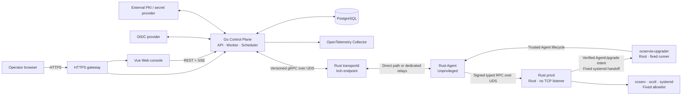

# ocservia

[](https://github.com/GentleKingson/ocservia/actions/workflows/ci.yml)
[](#license)

**A centralized, security-focused management plane for multiple [ocserv](https://ocserv.openconnect-vpn.net/) nodes.**

ocservia is a self-hosted platform for operating a fleet of OpenConnect VPN servers from one Web console and API. It keeps the VPN data plane on each ocserv host while adding controlled enrollment, fleet telemetry, narrowly scoped operations, desired user and group state, configuration workflows, approvals, audit trails, and recovery mechanisms.

The project combines a Go control plane, Rust transport and node components, a Vue and TypeScript Web application, PostgreSQL, [Iroh](https://www.iroh.computer/) connectivity, and OpenTelemetry.

> [!NOTE]
> **Development status:** ocservia v0.1.x is the current published release line. It is intended for controlled deployment and evaluation. Production deployments remain operator-validated, and no production SLA is provided. Because ocservia remains pre-1.0, compatibility may change between minor release lines. The production topology in this repository is a hardened reference deployment, not a production-readiness guarantee.

[Quick start](#quick-start) · [Capabilities](#capabilities) · [Architecture](#architecture) · [Security model](#security-model) · [Production reference](#production-reference) · [Documentation](#documentation)

## Why ocservia

Operating several independent ocserv servers usually means repeating account changes, inspecting state host by host, and relying on broad administrative access. ocservia introduces a central management plane while deliberately keeping the remote execution surface narrow.

| ocservia provides | ocservia does not provide |
| --- | --- |
| Fleet inventory, health, sessions, bans, and telemetry | A replacement VPN data plane; ocserv remains the VPN server |
| Typed and audited ocserv operations | SSH, a remote shell, or arbitrary command execution |
| Desired user, group, quota, expiry, and configuration state | Generic file management or a general-purpose configuration-management system |
| Enrollment, endpoint pinning, RBAC, approvals, and audit verification | Caller-selected executables, systemd units, command arguments, or filesystem paths |
| Direct or relay-assisted Agent connectivity | Unrestricted host administration |

## Capabilities

The following capabilities are implemented on `main`. Their presence does not imply a stable compatibility or production support commitment.

| Area | Current capability |
| --- | --- |
| Fleet visibility | Node inventory, online/offline state, ocserv status and version, connection path, sessions, IP bans, metrics, bounded history, and freshness handling |
| Node trust | One-time enrollment, explicit approval, Iroh EndpointID pinning, capability negotiation, authorization revisions, revocation, and reconnect fencing |
| Controlled operations | Session disconnect, session terminate, IP unban, and fixed `ocserv.service` reload with asynchronous operation state and idempotency |
| Users and groups | Desired and observed state, user creation, password rotation, enable/disable, group membership, revision tracking, convergence status, and bounded recovery evidence |
| Policy automation | Per-user traffic quota, exact UTC expiry, scheduler enforcement, bounded batch operations, backlog limits, and per-item results |
| Configuration | Deterministic template rendering, allowlisted directives, secret references, side-effect-free validation, secret-safe diffs, approved atomic apply, health checks, and rollback |
| Identity and authorization | OIDC Authorization Code flow with PKCE, workspace-scoped RBAC, independent content-bound approvals, short-lived sessions, and controlled break-glass access |
| Auditability | Business-operation audit intents, authenticated append-only event chains, signed checkpoints, terminal Agent results, and verification endpoints |
| Certificates and secrets | Node-generated private keys, signed CSRs, external PKI integration, purpose-separated sealed secrets, short-lived P12 artifacts, revocation, and external secret references |
| Delivery and recovery | Transactional outbox, versioned semantic command hashes, Agent idempotency journal, privileged desired-effect evidence, explicit `unknown` outcomes, and reconciliation |
| Agent lifecycle / fleet upgrades | Agent version intelligence, trusted release catalog, reconciled single-node upgrades, durable self-upgrade runner, mandatory one-node canaries, bounded rolling upgrades, eligibility rechecks, pause/resume, skipped-node semantics, and durable rollout state |
| Deployment operations | HTTPS-only reference topology, dedicated relays, PostgreSQL backup and restore workflow, credential rotation, signed Agent packaging, upgrade, rollback, and state-preserving removal |

## Architecture



### Components

| Component | Responsibility | Source |
| --- | --- | --- |
| Control Plane | HTTP API, OIDC sessions, RBAC, approvals, audit, scheduling, operations, reconciliation, and PostgreSQL persistence | [`control-plane/`](control-plane/) |
| Web console | Fleet views and controlled workflows using the generated API client | [`web/`](web/) |
| `transportd` | Owns the Iroh endpoint and bridges the Go boundary through a versioned Unix-socket gRPC contract | [`rust/crates/transportd/`](rust/crates/transportd/) |
| Agent | Maintains node connectivity, telemetry, command validation, and the durable SQLite command journal without root privileges | [`rust/crates/agent/`](rust/crates/agent/) |
| `privd` | Performs fixed, typed ocserv effects and independently verifies Controller-authorized AgentUpgrade handoffs | [`rust/crates/privd/`](rust/crates/privd/) |
| `ocservia-upgrader` | Fixed root-owned systemd runner that consumes verified intents, re-verifies releases from the local spool, persists terminal results, and converges after crashes or replay | [`rust/crates/upgrader/`](rust/crates/upgrader/) |
| ocserv adapter | Bounded parsing and fixed invocations for ocserv, `occtl`, `ocpasswd`, and service lifecycle operations | [`rust/crates/ocserv-adapter/`](rust/crates/ocserv-adapter/) |
| Contracts | Protobuf transport and Agent contracts plus the OpenAPI HTTP contract | [`proto/`](proto/) · [`openapi/`](openapi/) |
| Deployment assets | Local Compose stack, production reference topology, relay deployment, backup, and launch guards | [`deploy/`](deploy/) |

## Quick start

The fastest way to explore ocservia is the side-effect-free development stack.

### Prerequisites

- Git
- Docker Engine with the Compose v2 plugin, or Docker Desktop
- Available local ports `4173` and `8080`

### Start the development stack

```bash
git clone https://github.com/GentleKingson/ocservia.git
cd ocservia

docker compose -f deploy/compose/compose.yaml up --build -d
docker compose -f deploy/compose/compose.yaml ps

curl --fail --silent http://127.0.0.1:8080/readyz
curl --fail --silent http://127.0.0.1:8080/version
```

Open the Web console at:

```text
http://127.0.0.1:4173
```

The control-plane health endpoints are:

```text
http://127.0.0.1:8080/livez
http://127.0.0.1:8080/readyz
http://127.0.0.1:8080/version
```

Inspect logs with:

```bash
docker compose -f deploy/compose/compose.yaml logs -f \
  control-plane transportd-stub web
```

Stop the stack while preserving its development database:

```bash
docker compose -f deploy/compose/compose.yaml down
```

Remove the stack and its development volumes:

```bash
docker compose -f deploy/compose/compose.yaml down --volumes
```

> [!NOTE]
> The public development Compose stack uses a bounded Rust transport stub and simulated Agents. It does **not** run the real Iroh transport, connect to a real ocserv server, perform privileged operations, or create remote side effects. See [Control-plane development](docs/development/control-plane.md) for the exact behavior and configuration.

## Development

The repository pins its toolchains and downloaded validation tools. For native development:

```bash
make bootstrap
make verify
```

Common validation targets:

| Command | Purpose |
| --- | --- |
| `make verify` | Formatting, linting, contracts, Go, Rust, Web, boundary, security, license, generated-file, documentation, and repository-policy baseline |
| `make database-integration` | PostgreSQL migration and database integration coverage |
| `make integration` | Go, PostgreSQL, UDS, and Rust transport-stub integration slice |
| `make e2e` | Isolated browser-to-simulator Playwright workflow |
| `make p1-smoke` | Reduced resilience and capacity profile with all fault phases |
| `make p1-full` | Default 500-simulated-Agent single-host validation profile |
| `make generate` | Regenerate Protobuf and OpenAPI-derived artifacts |
| `make contracts-breaking` | Check public contract compatibility |

GitHub Actions remains the authoritative merge-time environment. Local commands reproduce the suites but do not replace required checks. See [GitHub Actions validation](docs/development/github-actions.md).

### API and wire contracts

- HTTP API: [`openapi/openapi.yaml`](openapi/openapi.yaml)
- Protobuf contracts: [`proto/`](proto/)
- Generated Web client: [`web/src/api/generated/`](web/src/api/generated/)
- Cross-language semantic command identity: [`docs/development/command-semantic-hash-v1.md`](docs/development/command-semantic-hash-v1.md) and [`docs/development/command-semantic-hash-v2.md`](docs/development/command-semantic-hash-v2.md)

Do not edit generated artifacts by hand. Update the source contract, run `make generate`, and include the generated diff and compatibility results with the change.

## Security model

ocservia is designed around explicit trust boundaries rather than broad remote administration.

| Boundary | Invariant |
| --- | --- |
| Browser and API | Production authentication uses OIDC with PKCE and Secure, HttpOnly, SameSite cookies; authorization is workspace-, resource-, and action-scoped |
| High-risk changes | Selected actions require approval by a different authorized principal; approvals are content-bound, expire, and are consumed transactionally |
| Controller to transport | Go communicates through a versioned gRPC Unix socket; `transportd` has no database credentials and authenticates exact local peers |
| Transport to Agent | Enrollment pins the node's Iroh EndpointID; sessions carry negotiated capabilities, authorization revision, and expiry |
| Controller commands | Every privileged operation is typed, signed, revision-fenced, expiry-fenced, capability-checked, and bound to a canonical semantic payload hash |
| Agent | Runs unprivileged, owns network connectivity and its SQLite journal, and treats duplicate delivery as replay rather than a second side effect |
| `privd` | Has no TCP listener, independently verifies Controller authorization for fixed ocserv effects and AgentUpgrade handoffs, accepts no arbitrary program, path, service, or raw command, and uses fixed bounded adapters |
| `ocservia-upgrader` | Runs as the fixed root-owned systemd runner, accepts only persisted upgrade intents, reads the fixed local package spool, re-verifies pinned release trust anchors, and persists terminal results |
| Recovery | Uncertain effects remain `unknown` until durable evidence proves applied or absent; missing evidence fails closed and never authorizes a blind retry |
| Audit | Business writes and audit intents commit together; events are append-only, hash chained, HMAC authenticated, and covered by independently keyed checkpoints |
| Secrets | Password and P12 sealing use distinct purpose-bound keys; certificate signing and secret values remain outside the control-plane database |

Report security issues privately as described in [SECURITY.md](SECURITY.md). Do not disclose vulnerabilities in public issues or pull requests.

## Production reference

The repository contains a security-hardened production **reference** in [`deploy/production/`](deploy/production/). It runs the HTTPS gateway, Control Plane, `transportd`, PostgreSQL, OpenTelemetry Collector, and backup worker, and exposes only TCP port 443.

Before evaluating that topology, read [Production deployment](docs/operations/production-deployment.md) in full. At minimum, a deployment requires:

- digest-pinned images and launcher-validated runtime paths;
- protected file-backed secrets outside the checkout;
- HTTPS OIDC with the exact callback URI;
- an external certificate signer and secret-sealing service;
- independently provisioned Controller, audit, session, relay, package-signing, and node-sealing keys;
- two independently operated dedicated Iroh relays;
- PostgreSQL base backups, WAL retention, protected off-host copies, and a tested restore;
- signed and independently verified Agent packages;
- explicit verification of readiness, authenticated API access, both relay paths, telemetry delivery, and recovery procedures.

Render and start the production reference only through its guarded launcher:

```bash
deploy/production/compose.sh config --quiet
deploy/production/compose.sh up -d
```

For a fresh Controller host, first prepare the Ubuntu 24.04 (amd64 or arm64)
host prerequisites with the bootstrap, which installs only missing host
software and non-secret directories, never creates secrets, and verifies the
launcher user can reach the Docker daemon:

```bash
deploy/production/bootstrap-host.sh check
sudo deploy/production/bootstrap-host.sh install --backup-dir "$OCSERV_BACKUP_DIR"
```

Then use the lifecycle entrypoint from the matching clean release checkout
with the published release manifest for the host architecture:

```bash
# amd64 host
deploy/production/controller.sh install \
  --release-file /path/to/controller-release-amd64.json

# arm64 host
deploy/production/controller.sh install \
  --release-file /path/to/controller-release-arm64.json
```

Direct `docker compose` invocation is not the supported production path because the launcher enforces image, secret, ownership, mode, path, and runtime-initialization requirements.

Managed-node installation and upgrades are documented separately in [Agent package lifecycle](docs/operations/agent-lifecycle.md). Enrollment and EndpointID trust are documented in [Enrollment and node trust](docs/development/enrollment.md).

## Project status

| Item | Status |
| --- | --- |
| End-to-end development stack | Available |
| Real Iroh transport and Agent | Available |
| Web fleet and management workflows | Available |
| Production-oriented deployment, relay, backup, and Agent lifecycle assets | Available as hardened reference workflows |
| Current release line | v0.1.x |
| Latest published release | v0.1.1 |
| Next release target | v0.2.0 — release readiness passed, not yet published |
| Compatibility commitment | Patch-level maintenance within v0.1.x; pre-1.0 minor lines may evolve |
| Production SLA or capacity guarantee | Not provided |
| Security support | Latest v0.1.x patch release |

The P1 harness exercises up to 500 side-effect-free simulated Agents, fault injection, restarts, PostgreSQL interruption, slow SSE consumers, and explicit unknown outcomes on a single GitHub-hosted runner. This is initial engineering evidence, not a production capacity claim. Multi-host, long-duration, and deployment-specific validation remain the operator's responsibility.

## Repository layout

```text
.
├── control-plane/       Go API, workers, scheduler, migrations, and persistence
├── rust/                Agent, privd, transportd, contracts, journal, and adapters
├── web/                 Vue, TypeScript, Vite, Vitest, and Playwright application
├── proto/               Protobuf source contracts
├── openapi/             HTTP API contract
├── deploy/              Development and production deployment assets
├── docs/                Development, security, operations, and upstream records
├── scripts/             Bootstrap, validation, packaging, deployment, and recovery tools
├── testdata/            Shared and cross-language fixtures
├── Makefile             Common developer and validation entry points
├── SECURITY.md          Private vulnerability-reporting policy
└── LICENSE              Apache License 2.0
```

## Documentation

### Start here

- [Control-plane development](docs/development/control-plane.md)
- [Public contracts and generation](docs/development/contracts.md)
- [GitHub Actions validation](docs/development/github-actions.md)
- [P1 resilience and initial capacity validation](docs/development/p1-resilience-capacity.md)

### Transport, enrollment, and node boundary

- [Iroh transport development](docs/development/transportd.md)
- [Enrollment and node trust](docs/development/enrollment.md)
- [Agent and privd](docs/development/agent-privd.md)
- [Agent command journal and recovery](docs/development/agent-command-journal.md)
- [Controller command authorization v1](docs/development/command-authorization-v1.md)

### Fleet state and controlled operations

- [Telemetry and read-only fleet views](docs/development/telemetry.md)
- [Operations and transactional outbox](docs/development/operations-outbox.md)
- [Controlled session and service operations](docs/development/session-operations.md)
- [User and group state](docs/development/user-group-state.md)
- [Quota, expiry, and batch operations](docs/development/quota-expiry-batch.md)

### Configuration, identity, certificates, and audit

- [Identity, authorization, approval, and audit](docs/development/identity-authorization-audit.md)
- [Configuration planning](docs/development/config-plan.md)
- [Configuration apply and rollback](docs/development/config-apply.md)
- [Certificate and secret lifecycle](docs/development/certificate-secret-lifecycle.md)

### Deployment and recovery

- [Production deployment](docs/operations/production-deployment.md)
- [Agent package lifecycle](docs/operations/agent-lifecycle.md)
- [Dedicated relays](docs/operations/dedicated-relays.md)
- [PostgreSQL backup](docs/operations/postgres-backup.md)
- [Incident recovery](docs/operations/incident-recovery.md)

### Upstream provenance

Upstream review and backport records are kept in [`docs/upstream/`](docs/upstream/). Imported behavior must preserve source attribution, license compatibility, and an auditable comparison record.

## Development expectations

Changes to ocservia should preserve the project's narrow-operation security boundary and recovery semantics.

- Keep public HTTP and Protobuf changes additive unless an explicitly reviewed compatibility break is intended.
- Never introduce a generic shell, arbitrary executable, caller-selected path, or caller-selected systemd unit.
- Treat queueing and dispatch as intermediate states, not proof of remote success.
- Preserve idempotency, authorization, audit, and reconciliation evidence across retries, restarts, upgrades, and rollback.
- Add or update tests, documentation, generated artifacts, threat-boundary checks, and migration recovery notes with behavioral changes.
- Run `make verify` and the relevant integration, E2E, native, or capacity workflow before proposing a merge.

## Support and reporting

Use [GitHub issues](https://github.com/GentleKingson/ocservia/issues) for reproducible non-security bugs and scoped feature discussions. Include the exact commit, environment, expected behavior, actual behavior, and relevant redacted diagnostics.

For vulnerabilities, follow [SECURITY.md](SECURITY.md) and use GitHub Private Vulnerability Reporting or a private draft security advisory. Never include credentials, private keys, enrollment tokens, sealed secrets, password material, or unredacted production logs in a public report.

## License

Unless otherwise noted, ocservia is licensed under the Apache License 2.0.

See [LICENSE](LICENSE) for the full license text.

Third-party attribution and licensing information is recorded in [THIRD_PARTY_NOTICES.md](THIRD_PARTY_NOTICES.md).

## Acknowledgements

ocservia builds on the work of the [ocserv](https://ocserv.openconnect-vpn.net/) and OpenConnect communities, [Iroh](https://www.iroh.computer/), PostgreSQL, OpenTelemetry, Go, Rust, Vue, and the wider open-source ecosystem.

ocservia is an independent project and is not a general-purpose remote-management tool.
