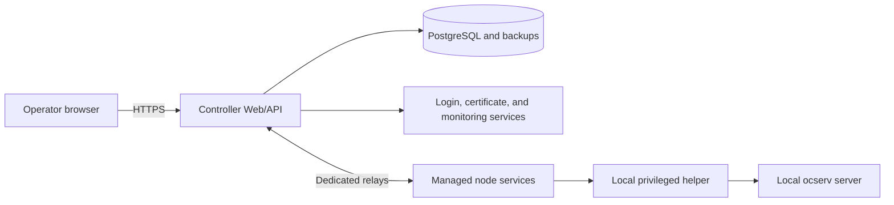

# Architecture

ocservia adds a management layer around existing ocserv / OpenConnect VPN servers. The VPN servers still run ocserv and still carry the VPN traffic. ocservia gives operators one Controller for visibility, user and group workflows, configuration changes, enrollment, upgrades, audit records, and recovery.

## High-level view



## Main pieces

| Piece | Runs on | What it does |
| --- | --- | --- |
| Controller Web/API | Controller server | Provides the Web console, HTTP API, scheduling, audit records, node inventory, and lifecycle commands. |
| PostgreSQL | Controller side | Stores Controller data and recovery state. |
| Dedicated relays | Operator-managed relay hosts | Carry Controller-to-node traffic for production deployments. |
| Managed node service | Each ocserv server | Connects the node to the Controller, reports health, receives approved work, and records results. |
| Local privileged helper | Each ocserv server | Runs only fixed ocserv-related actions that require root access. |
| ocserv | Each VPN server | Remains the actual VPN server. |
| External services | Operator environment | Provide login, certificate signing, monitoring, secrets, and protected backups. |

## How deployment fits together

1. Deploy the Controller on a supported Linux host.
2. Prepare production settings in `install.env` and provision secrets outside the repository checkout.
3. Configure two dedicated relays for production node communication.
4. Install the managed-node package on each ocserv server.
5. Enroll each node, approve it in the Controller, and then start the node services.
6. Use the Web console or API to view health, manage users, inspect sessions, apply configuration changes, and run lifecycle operations.

## How a node change is applied

```text
Operator request
  -> Controller validates and records the request
  -> high-risk changes wait for independent approval
  -> Controller sends a signed, fixed operation to the node
  -> node runs the matching local ocserv action
  -> result and audit record return to the Controller
```

The important rule is that ocservia is not a remote shell. It does not accept arbitrary commands, arbitrary programs, caller-selected service names, or caller-selected filesystem paths for privileged work. Node-side privileged work is limited to fixed ocserv operations implemented by the project.

## Safety model

- Production installs are pinned to an exact release version.
- Controller and node packages are verified before activation.
- Secrets, certificates, passwords, relay tokens, and signing keys are prepared by the operator through protected channels.
- Some high-risk operations require review by a different authorized operator.
- Audit records are written with the business change they describe.
- Backups and rollback paths are part of the production deployment model.

## Where to read more

- [Deploy the Controller](getting-started/production.md)
- [Install a managed node](getting-started/managed-node.md)
- [Enroll a node](how-to/enroll-node.md)
- [Dedicated relays](how-to/dedicated-relays.md)
- [Production deployment reference](operations/production-deployment.md)
- [Agent package lifecycle](operations/agent-lifecycle.md)
- [Technical reference](reference/README.md)
