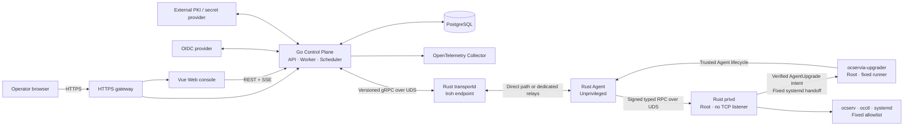

# Architecture and trust boundaries

ocservia is a self-hosted management plane for fleets of [ocserv](https://ocserv.openconnect-vpn.net/) / OpenConnect VPN servers. ocserv remains the VPN server and data plane on every managed host; ocservia adds the central Web console, API, scheduling, and audited remote operations. See the [repository README](../README.md) for the project overview and the [documentation index](README.md) for other documents.

## High-level architecture

## Components

| Component | Responsibility | Source |
| --- | --- | --- |
| Control Plane | HTTP API, OIDC sessions, RBAC, approvals, audit, scheduling, operations, reconciliation, and PostgreSQL persistence | [`control-plane/`](../control-plane/) |
| Web console | Fleet views and controlled workflows using the generated API client | [`web/`](../web/) |
| `transportd` | Owns the Iroh endpoint and bridges the Go boundary through a versioned Unix-socket gRPC contract | [`rust/crates/transportd/`](../rust/crates/transportd/) |
| Agent | Maintains node connectivity, telemetry, command validation, and the durable SQLite command journal without root privileges | [`rust/crates/agent/`](../rust/crates/agent/) |
| `privd` | Performs fixed, typed ocserv effects and independently verifies Controller-authorized AgentUpgrade handoffs | [`rust/crates/privd/`](../rust/crates/privd/) |
| `ocservia-upgrader` | Fixed root-owned systemd runner that consumes verified intents, re-verifies releases from the local spool, persists terminal results, and converges after crashes or replay | [`rust/crates/upgrader/`](../rust/crates/upgrader/) |
| ocserv adapter | Bounded parsing and fixed invocations for ocserv, `occtl`, `ocpasswd`, and service lifecycle operations | [`rust/crates/ocserv-adapter/`](../rust/crates/ocserv-adapter/) |
| Contracts | Protobuf transport and Agent contracts plus the OpenAPI HTTP contract | [`proto/`](../proto/) · [`openapi/`](../openapi/) |
| Deployment assets | Local Compose stack, production reference topology, relay deployment, backup, and launch guards | [`deploy/`](../deploy/) |

## Trust boundaries

ocservia is designed around explicit trust boundaries rather than broad remote administration.

| Boundary | Invariant |
| --- | --- |
| Browser and API | Production authentication uses OIDC with PKCE and Secure, HttpOnly, SameSite cookies; authorization is workspace-, resource-, and action-scoped |
| High-risk changes | Selected actions require approval by a different authorized principal; approvals are content-bound, expire, and are consumed transactionally |
| Controller to transport | Go communicates through a versioned gRPC Unix socket; `transportd` has no database credentials and authenticates exact local peers |
| Transport to Agent | Enrollment pins the node's Iroh EndpointID; sessions carry negotiated capabilities, authorization revision, and expiry |
| Controller commands | Every privileged operation is typed, signed, revision-fenced, expiry-fenced, capability-checked, and bound to a canonical semantic payload hash |
| Agent | Runs unprivileged, owns network connectivity and its SQLite journal, and treats duplicate delivery as replay rather than a second side effect |
| `privd` | Has no TCP listener, independently verifies Controller authorization for fixed ocserv effects and AgentUpgrade handoffs, accepts no arbitrary program, path, service, or raw command, and uses fixed bounded adapters |
| `ocservia-upgrader` | Runs as the fixed root-owned systemd runner, accepts only persisted upgrade intents, reads the fixed local package spool, re-verifies pinned release trust anchors, and persists terminal results |
| Recovery | Uncertain effects remain `unknown` until durable evidence proves applied or absent; missing evidence fails closed and never authorizes a blind retry |
| Audit | Business writes and audit intents commit together; events are append-only, hash chained, HMAC authenticated, and covered by independently keyed checkpoints |
| Secrets | Password and P12 sealing use distinct purpose-bound keys; certificate signing and secret values remain outside the control-plane database |

Report security issues privately as described in [`SECURITY.md`](../SECURITY.md).

## Where to read more

- [Iroh transport development](development/transportd.md)
- [Node enrollment development](development/enrollment.md)
- [Agent and privd](development/agent-privd.md)
- [Agent command journal](development/agent-command-journal.md)
- [Controller command authorization v1](development/command-authorization-v1.md)
- [Command semantic hash v1](development/command-semantic-hash-v1.md) and [v2](development/command-semantic-hash-v2.md)
- [Identity, authorization, approval, and audit operations](development/identity-authorization-audit.md)
- [Operations and transactional outbox](development/operations-outbox.md)
- [Agent package lifecycle](operations/agent-lifecycle.md)
