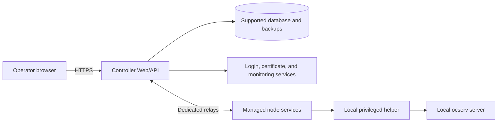

# Architecture

ocservia adds a management layer around existing ocserv / OpenConnect VPN servers. The VPN servers still run ocserv and still carry the VPN traffic. ocservia gives operators one Controller for visibility, user and group workflows, configuration changes, enrollment, upgrades, audit records, and recovery.

## High-level view



## Main pieces

| Piece | Runs on | What it does |
| --- | --- | --- |
| Controller Web/API | Controller server | Provides the Web console, HTTP API, scheduling, audit records, node inventory, and lifecycle commands. |
| Supported database | Controller side | Stores Controller data and recovery state; PostgreSQL is the default, not the only backend. |
| Dedicated relays | Operator-managed relay hosts | Carry Controller-to-node traffic for production deployments. |
| Managed node service | Each ocserv server | Connects the node to the Controller, reports health, receives approved work, and records results. |
| Local privileged helper | Each ocserv server | Runs only fixed ocserv-related actions that require root access. |
| ocserv | Each VPN server | Remains the actual VPN server. |
| External services | Operator environment | Provide login, certificate signing, monitoring, secrets, and protected backups. |

## How deployment fits together

Choose a backend and deployment mode from the authoritative
[production support matrix](operations/production-deployment.md#database-support).
Development/test coverage is not production support. Backup and recovery
capabilities also differ by backend; see [database recovery](operations/incident-recovery.md#database-recovery).

1. Deploy the Controller on a supported Linux host.
2. Prepare production settings in `install.env` and provision secrets outside the repository checkout.
3. Configure one dedicated relay for non-redundant production node communication,
   or two dedicated relays for the recommended redundant deployment.
4. Install the managed-node package on each ocserv server.
5. Enroll each node, approve it in the Controller, and then start the node services.
6. Use the Web console or API to view health, manage users, inspect sessions, apply configuration changes, and run lifecycle operations.

## How a node change is applied

```text
Operator request
  -> Controller validates and records the request
  -> high-risk changes wait for independent approval
  -> Controller sends a signed, fixed operation to the node
  -> node runs the matching local ocserv action
  -> result and audit record return to the Controller
```

The important rule is that ocservia is not a remote shell. It does not accept arbitrary commands, arbitrary programs, caller-selected service names, or caller-selected filesystem paths for privileged work. Node-side privileged work is limited to fixed ocserv operations implemented by the project.

## Safety model

- Production installs are pinned to an exact release version.
- Controller and node packages are verified before activation.
- Secrets, certificates, passwords, relay tokens, and signing keys are prepared by the operator through protected channels.
- Some high-risk operations require review by a different authorized operator.
- Audit records are written with the business change they describe.
- Backups and rollback paths are part of the production deployment model.

## Development architecture

ocservia is a modular monorepo. The Controller is a domain-led modular
monolith; transport, privileged node execution and upgrades retain separate
trust and lifecycle boundaries. Web separates page composition, interaction
workflows, request adapters and generated contracts. Extend these existing
owners rather than targeting a fixed number of layers, packages or files.

### Ownership and task navigation

Read the entries relevant to the change, not this entire list for every task.
This overview holds the current principles; the linked topics explain their
implementation and compatibility details.

| Boundary / task | Responsibility and dependency direction | Read next |
| --- | --- | --- |
| Startup and assembly | `cmd` and `platform/app` assemble shared services and manage startup/shutdown. Business modules do not import the assembly entry points. | [`platform/app`](../control-plane/internal/platform/app/) |
| HTTP compatibility | HTTP modules decode requests, adapt authentication/authorization context and map responses. Stable business preparation and state rules belong to existing domain services, not duplicated handler logic. | [HTTP baseline](development/http-baseline.md) |
| Controller services | Collaborate through existing services and the consumer capabilities needed today; do not add empty service/usecase/domain layers. | [Consumer service boundaries](development/domain-service-boundaries.md) |
| Data and transactions | Domain Store contracts isolate SQL and drivers. The business operation owner manages the shared `database.Tx`; multiple Stores may participate in that transaction. Adapters implement Store contracts; business code does not import concrete database adapters. | [`database` boundary](../control-plane/internal/database/database.go), [existing boundary check](../control-plane/internal/database/boundary_test.go), [operations and outbox](development/operations-outbox.md) |
| Runtime and privileges | `transportd` is Controller-side transport, not a node privilege helper. Agent, privd and upgrader retain their distinct execution authority and lifecycle. | [Transport](development/transportd.md), [Agent/privd](development/agent-privd.md), [Agent lifecycle](operations/agent-lifecycle.md) |
| Web API and Workspace | Pages compose routing and features; features own interaction workflows; API modules adapt requests to generated clients. Do not duplicate session coordination or Workspace state. | [Web API boundaries](development/web-api-boundaries.md), [node-detail features](development/node-detail-features.md) |
| Protocols and generated code | Proto and OpenAPI are schema authorities. Local protocols and canonical signing have their own versioned contracts; serialized Proto bytes are not canonical signing input. Generated code carries no handwritten business logic. | [Contracts](development/contracts.md), [Agent/privd protocol](development/agent-privd.md), [command authorization](development/command-authorization-v1.md), [semantic hash v2](development/command-semantic-hash-v2.md) |
| Deployment | Reuse versioned assets, separately provisioned trust material and the existing install/upgrade entry points, not a new deployment framework. | [Production deployment](operations/production-deployment.md), [Controller upgrade](how-to/controller-upgrade.md), [Agent lifecycle](operations/agent-lifecycle.md) |
| Validation | Choose the smallest sufficient check for the changed behavior and its contracts. | [Validate a change](development/testing.md) |

The diagrams above describe runtime communication, not a mandatory import
chain. Assembly holding a service, one process calling another, and a package
importing an adapter are different relationships. Existing system/deployment
views are sufficient unless a change needs another view to explain a boundary;
there is no requirement to draw every C4 level.

### Intentional exceptions

- A consumer interface with one implementation can still enforce a useful
  minimum capability boundary; implementation count alone is not a reason to
  remove it.
- A cross-domain transaction can be required for atomicity. Do not split its
  commit merely to match directory boundaries.
- HTTP input checks, state rechecks under a lock and privileged execution
  checks protect different moments and trust boundaries; they are not
  automatically redundant.
- Necessary Cookie/OIDC HTTP integration in `auth`, backend-specific database
  semantics and documented route compatibility are not subject to mechanical
  layer uniformity.
- Large files, shared DTOs and package counts are investigation signals, not
  defects by themselves. Require evidence of a responsibility or dependency
  problem before restructuring them.

### Evolution and decisions

Ordinary fixes inside these boundaries proceed directly within the task's
authorization. For a feature following an existing pattern, identify its owner.
For changes to data/transaction ownership, public contracts, process/privilege
boundaries or runtime components, explain the requirement, constraints,
relevant quality attributes, evidence, alternatives, costs, compatibility and
rollback. This is not a new approval gate and does not replace user or platform
authorization requirements.

Evaluate service extraction when evidence calls for independent scaling,
release cadence or failure isolation. Evaluate new caches or messaging
components against an observed bottleneck or concrete delivery requirement,
not anticipated fashion or file size. Evaluation does not imply adoption or
new capacity, latency or availability commitments. Report task-relevant
deviations without automatically refactoring the repository or weakening a
rule to accommodate an unjustified implementation.

Use a short architecture decision record only for a significant tradeoff,
alongside the relevant existing public topic. Record status, context,
decision, alternatives, consequences, validation/compatibility
requirements and reevaluation conditions. Mark drafts as proposed; retain
superseded decisions with a link to their replacement. Ordinary fixes do not
need an ADR, a template directory or retrospective records for every past PR.

The proposed [Integrated deployment contract](development/integrated-deployment-adr.md)
records the single-host network, Signer and delivery decisions. It is not an
implemented deployment mode or an expansion of current production support.

The reasoning method follows [Awesome Architecture](https://github.com/study8677/awesome-architecture)
chapters 02 and 08; diagram scope follows the [C4 guidance](https://c4model.com/diagrams),
and lightweight decision history follows [Nygard's ADR method](https://www.cognitect.com/blog/2011/11/15/documenting-architecture-decisions).
These are methods, not evidence that ocservia needs a particular architecture;
the repository boundaries above come from the linked implementation and topics.

## Where to read more

- [Deploy the Controller](getting-started/production.md)
- [Install a managed node](getting-started/managed-node.md)
- [Enroll a node](how-to/enroll-node.md)
- [Dedicated relays](how-to/dedicated-relays.md)
- [Production deployment reference](operations/production-deployment.md)
- [Agent package lifecycle](operations/agent-lifecycle.md)
- [Technical reference](reference/README.md)
