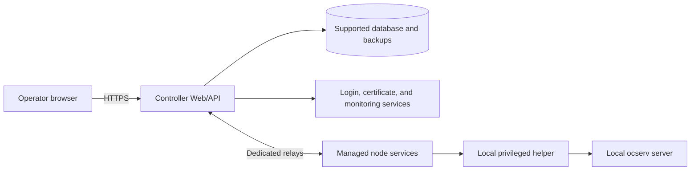

# Architecture

ocservia provides a control plane for OpenConnect (ocserv) VPN gateways. The gateways still terminate client tunnels and forward payload traffic independently. ocservia shifts node management to a central Controller that handles cluster visibility, user and group provisioning, configuration distribution, node enrollment, software updates, audit logging, and state recovery.

## Purpose and constraints

Operators need to verify node trust and reachability, push configurations without interactive host access, and trace commands when their outcomes are ambiguous. High-risk changes require multi-party approval. During disaster recovery, node identities and the logs of state transitions must remain intact.

The supported production topology uses one Controller instance, a relational database, and an isolated Relay intermediary that services multiple Agents. These components can run on distinct hosts. High-availability setups like multi-master Controller clusters, redundant Relays, or automated database failovers are outside the [supported scope](reference/support-policy.md#deployment-capability-distinctions). Internal lease coordination and service modularity do not change this boundary.

The system isolates the data plane: client VPN sessions terminate at the ocserv instances and never transit the Controller or Relay. If the control or relay infrastructure goes down, administrative tools fail but active tunnels keep running. However, local node crashes or flawed ocserv daemon reloads still disrupt traffic. A deployment requires pre-provisioned cryptographic credentials, functional DNS and TLS, and a certified database instance. Certificate management requires a Signer service, and single sign-on workflows need an OpenID Connect (OIDC) identity provider.

## High-level view


```mermaid
flowchart LR
    Operator["Operator browser"] -->|HTTPS| Controller["Controller Web/API"]
    Controller --> Database[("Supported database and backups")]
    Controller --> Services["Login, certificate, and monitoring services"]
    Controller <-->|Dedicated relays| Node["Managed node services"]
    Node --> Helper["Local privileged helper"]
    Helper --> Ocserv["Local ocserv server"]
```

## Main pieces

| Piece | Runs on | What it does |
| --- | --- | --- |
| Controller Web/API | Controller server | Hosts the administrative web interface, HTTP API, task scheduler, audit subsystem, node directory, and command dispatch pipeline. |
| transportd | Controller side | Terminates Iroh overlay connections and exposes an IPC interface over a local gRPC Unix domain socket to the Go Controller. It operates without database credentials, relying on a trust socket for Controller-managed session authorization. |
| Supported database | Controller side | Persists control-plane state, task queues, and recovery journals. PostgreSQL is the reference backend. |
| Dedicated relays | Operator-managed relay hosts | Route encrypted control-plane traffic between Controller and Agents across network boundaries. |
| Managed node service | Each ocserv server | Connects to the Controller, streams telemetry and heartbeats, accepts validated commands, and logs execution status. |
| Local privileged helper | Each ocserv server | Runs a fixed set of ocserv lifecycle routines that require root privileges. |
| Upgrader | Each managed node | Manages package installation and binary updates independently of the Agent execution loop. |
| ocserv | Each VPN server | The underlying OpenConnect VPN daemon handling client encapsulation and cryptographic tunneling. |
| External services | Operator environment | Provide external infrastructure for federated authentication, X.509 certificates, telemetry collection, secret storage, and backups. |

At runtime, the Go control plane communicates with `transportd` through a local Unix domain socket. `transportd` and remote `Agent` daemons exchange versioned Protocol Buffer payloads over an Iroh peer-to-peer overlay. On the nodes, the `Agent` delegates privileged actions to `privd` via a dedicated Unix domain socket. All sockets enforce strict peer UID validation. Intermediate Relay nodes forward encrypted packets without acquiring control-plane authority. For wire protocols and process isolation semantics, see [transport](development/transportd.md) and [Agent/privd](development/agent-privd.md).

## How deployment fits together

Target environments must fall within the [production support matrix](operations/production-deployment.md#database-support). Test harness configurations do not carry production guarantees. Backup semantics and disaster recovery procedures vary by database engine, as explained in [database recovery](operations/incident-recovery.md#database-recovery).

1. Provision the Controller on a verified Linux distribution.
2. Configure environment parameters in `install.env` and inject cryptographic secrets out-of-band to keep them out of the repository checkout.
3. Set up a dedicated Relay instance to route control-plane network traffic.
4. Distribute and install the node agent package across target ocserv hosts.
5. Run the cryptographic enrollment workflow for each host, verify the pending node in the Controller, and start the node daemons.
6. Administer node fleets, monitor telemetry, enforce access policies, and schedule configuration changes via the HTTP API or web console.

## How a node change is applied

```text
Operator request
  -> Controller validates and records the request
  -> high-risk changes wait for independent approval
  -> Controller sends a signed, fixed operation to the node
  -> node runs the matching local ocserv action
  -> result and audit record return to the Controller
```

Command processing decouples request ingestion from remote execution:

1. Ingestion and transactional staging: The API handler maps the request to the domain service. Inside an isolated database transaction, the service verifies node state and operator permissions, then commits the operation intent, payload, transactional outbox record, and audit entry. This transactional acceptance logs the intent; it does not mean the node has executed it.
2. Outbox dispatch: An asynchronous worker locks and claims pending outbox tasks in batches, then invokes `transportd`. Dispatch occurs across an active session under the transport session identity. Network transmission updates the dispatch tracking but does not confirm the operation succeeded.
3. Node admission and idempotency: The `Agent` validates the payload and writes the command identifier to an embedded SQLite journal before running it. If a command with the same identifier and semantic hash arrives again, `Agent` skips execution and replays the cached result. Any payload mismatch under an existing identifier results in immediate rejection.
4. Privileged execution and settlement: For mutating operations, `Agent` transitions the task state to `running` before invoking `privd` over local IPC. `privd` validates the parameters against fixed authorization rules and issues signed execution receipts upon completion. `Agent` writes the terminal status to disk before returning an acknowledgment. The Controller ingests this confirmation, making the outcome available to API queries and Server-Sent Event (SSE) streams.

This lifecycle runs across the [operation service](../control-plane/internal/operations/service.go), the [outbox worker](../control-plane/internal/operations/worker.go), and the [Agent execution path](../rust/crates/agent/src/main.rs). The [delivery and recovery contract](development/command-reliability.md) governs idempotency, result verification, and conflict reconciliation. Because local database commits, network transit, and daemon side-effects lack a unified distributed transaction coordinator, communication failures or crashes may leave operations in an `unknown` state. Automated recovery procedures must reconcile ambiguous executions against node receipts before retrying; daemon status queries alone cannot confirm whether a transient reload completed.

Privileged execution on managed nodes is restricted to a set of pre-compiled subroutines. The system disallows arbitrary binaries, parameterized shell strings, dynamic service identifiers, or unconstrained file paths.

Node enrollment operates via an isolated protocol. An ephemeral pre-shared token links a node's persistent `EndpointID` with a pending inventory entry. An administrator approves the registration, which lets the local `Agent` negotiate an authenticated transport session. Package deployment and service initiation do not grant connectivity before this handshake. For specifications, see [enrollment](how-to/enroll-node.md) and the [Controller service](../control-plane/internal/enrollment/service.go).

## State and recovery boundaries

| State | Authority and persistence | Recovery consequence |
| --- | --- | --- |
| Node trust, desired state, operations and audit history | Controller database, accessed through domain Store contracts | Uncertain commits require keeping original operation identifiers and payloads. Client-side timeouts must not trigger uncoordinated duplicate submissions. |
| Command acceptance and results | Agent-owned SQLite journal | The local journal must survive process restarts and package upgrades. Purging it breaks replay detection and recovery auditing. |
| Privileged effects | Node-side effect records and signed privd receipts | Reconciliation demands cryptographic proofs tied to the specific command identifier. Reaching the expected configuration hash does not prove a historical invocation succeeded. |
| Certificate issuance and revocation | Signer's durable ledger and issuing identity | Signer ledgers and Controller datastores require coordinated restoration before resuming certificate operations. Persisted revocation entries do not automatically flush active client tunnels or publish certificate revocation lists (CRLs). |
| Health and session observations | Agent reports ingested into Controller read models | Telemetry freshness is distinct from transport reachability. A cached telemetry record shows historical observations and does not guarantee the daemon is currently responsive. |

Disruptions to the Controller or database halt workflows that require validation or durable writes. Unprocessed operations wait in the outbox until they expire or exhaust retries. If `Agent` or `privd` fails midway through execution, the state transition is indeterminate even if the network delivery succeeded. A Relay partition drops administrative transport. Recovery means restoring the Relay node, re-establishing secure sessions, and executing state reconciliation across connected nodes.

System recovery prioritizes the immutability of command logs, local journal entries, cryptographic identities, and monotonic sequence counters. Cold backups require an independently validated restoration workflow; they do not provide automatic failover or cross-version schema guarantees. Detailed specifications appear in [incident recovery](operations/incident-recovery.md), [Signer recovery](development/integrated-deployment-adr.md#compatibility-and-recovery), and [resilience coverage](development/resilience.md).

## Design tradeoffs and capacity

The Controller uses a modular monolithic architecture where domain services coordinate within shared database transactions. This guarantees atomic consistency between domain entity mutations and audit logging without distributed coordination overhead. Splitting these packages into microservices would require external distributed transaction management, which the system does not currently need. The [assembly code](../control-plane/internal/platform/app/app.go) selectively enables API, background worker, or scheduler roles, all of which run from one binary.

The database-backed outbox pattern couples intent capture with pending delivery in a single transactional write, avoiding a separate message broker. As a result, task leasing, operational history, and primary business writes compete for the same database resources. Background polling loops ensure progress even if in-memory notification channels fail. While local `Agent` journaling mitigates redelivery issues, operations terminating in ambiguous states still require active reconciliation.

Splitting the processes across `transportd`, `Agent`, `privd`, and `upgrader` introduces IPC overhead and requires multi-process lifecycle coordination. In exchange, it isolates network dependencies and root privileges from control-plane domain logic. Merging these daemons into a single binary would collapse distinct privilege levels and security boundaries.

System throughput depends primarily on database row-level contention, worker polling latency, and serialized node-level task execution. The [worker](../control-plane/internal/operations/worker.go) processes claimed task batches in serial order, mirroring the sequential execution of mutating commands in the `Agent`. The global [command limit](../control-plane/internal/commandlimit/limit.go) prevents bufferbloat across nodes and workspaces; it is an admission control mechanism, not a guaranteed throughput rate.

Before modifying concurrency parameters or adding infrastructure, operators should profile system metrics—including queue depth, maximum uncommitted task age, transaction lock contention, and observation freshness—under representative workloads. [Queue metrics](development/command-reliability.md#controller-delivery) show dispatch latency, but an empty queue does not guarantee downstream execution succeeded. Formal service level objectives (SLOs) require empirical calibration against deployment profiles. Re-architecting subsystem boundaries should target reproducible performance bottlenecks and include fault-recovery evaluations.

## Safety model

- Production deployments use immutable, verified release versions.
- Controller and node binaries require cryptographic signature and checksum validation before activation.
- Cryptographic material, including private keys, TLS certificates, relay tokens, and administrative credentials, is provisioned through isolated, out-of-band channels.
- High-risk mutating operations enforce two-person authorization, requiring independent review from a secondary operator.
- Audit records commit within the same database transaction as the changes they document.
- Formal disaster recovery procedures and verified rollback paths are prerequisites for production deployment.

## Development architecture

ocservia is a modular monorepo. The Controller operates as a domain-driven modular monolith, while transport mediation, privileged host execution, and package upgrades maintain isolated trust and lifecycle boundaries. The web tier decouples route composition, interaction workflows, API client adapters, and generated schema definitions. System evolution should extend these existing boundaries and avoid arbitrary abstractions or unnecessary package layers.

### Ownership and task navigation

Read the entries relevant to the change, not this entire list for every task.
This overview holds the current principles; the linked topics explain their
implementation and compatibility details.

| Boundary / task | Responsibility and dependency direction | Read next |
| --- | --- | --- |
| Startup and assembly | `cmd` and `platform/app` manage dependency injection, subsystem composition, and graceful process lifecycles. Domain packages must maintain inward dependency directions and never import assembly packages. | [`platform/app`](../control-plane/internal/platform/app/) |
| HTTP compatibility | Transport handlers deserialize request payloads, bind authorization contexts, and format responses. Business invariants and transactional state management remain inside domain services. | [HTTP baseline](development/http-baseline.md) |
| Controller services | Components interact via declared consumer interfaces matching concrete functional requirements. Avoid speculative abstractions or extra indirection layers. | [Consumer service boundaries](development/domain-service-boundaries.md) |
| Data and transactions | Domain store interfaces abstract relational persistence and driver dependencies. The initiating domain service governs the transaction boundary (`database.Tx`), allowing multiple storage adapters to enlist in the same atomic unit of work without domain code depending on concrete database drivers. | [`database` boundary](../control-plane/internal/database/database.go), [existing boundary check](../control-plane/internal/database/boundary_test.go), [operations and outbox](development/command-reliability.md#controller-delivery) |
| Runtime and privileges | `transportd` isolates control-plane overlay networking, running without host-level privileges. On managed hosts, `Agent`, `privd`, and `upgrader` execute under separated system identities and autonomous lifecycles. | [Transport](development/transportd.md), [Agent/privd](development/agent-privd.md), [Agent lifecycle](operations/agent-lifecycle.md) |
| Web API and Workspace | The frontend architecture separates route composition from interaction logic and client API adapters. Session coordination and workspace states must remain canonical without redundant state machines. | [Web API boundaries](development/web.md#api-boundaries), [node-detail features](development/web.md#node-detail-workflows) |
| Protocols and generated code | Protocol Buffers and OpenAPI definitions serve as normative schema contracts. IPC boundaries and cryptographic signatures enforce explicit, versioned serialization; raw protobuf byte streams must not be used as cryptographic signing inputs. Generated artifacts stay segregated from domain logic. | [Contracts](development/contracts.md), [Agent/privd protocol](development/agent-privd.md), [command authorization](development/command-authorization-v1.md), [semantic hash v2](development/command-semantic-hash-v2.md) |
| Deployment | Operational deployments use versioned binaries, out-of-band cryptographic material, and existing lifecycle scripts. Do not introduce custom deployment frameworks. | [Production deployment](operations/production-deployment.md), [Controller upgrade](how-to/controller-lifecycle.md#upgrade), [Agent lifecycle](operations/agent-lifecycle.md) |
| Validation | Verification relies on targeted test coverage that validates behavioral invariants and contract guarantees. | [Validate a change](development/testing.md) |

The architectural diagrams show runtime interactions, which differ from source-level import hierarchies. Process composition, inter-process communication, and adapter binding are orthogonal concerns. The existing structure is normative; modifications require new architectural views only when clarifying novel trust or isolation boundaries.

### Intentional exceptions

- Defining an interface with a single implementation is valid when isolating capabilities across domain boundaries.
- Preserving atomic consistency may require transactions spanning multiple domain entities; transactional integrity takes precedence over rigid package separation.
- Request schema sanitization, concurrency locks during state re-verification, and daemon-level authorization checks safeguard distinct failure domains. They are non-redundant defense-in-depth measures.
- Stateful HTTP cookie handling in `auth`, storage-specific SQL semantics, and backward-compatible route mappings are exempt from uniform architectural layering when protocol constraints dictate.
- Elevated file sizes, shared data transfer objects (DTOs), and high package counts serve as diagnostic signals during code review; they are not inherently defects. Refactoring requires evidence of coupling or boundary violations.

### Evolution and decisions

Routine modifications within established boundaries only need standard change authorization. When adding capabilities that fit existing patterns, map them to the designated domain owner. Proposals modifying transaction boundaries, public schema contracts, privilege separations, or runtime architectures must document the requirements, technical constraints, trade-offs, alternative approaches, migration costs, and rollback strategies.

Subsystem decomposition into standalone services requires demonstrable needs for autonomous scalability, separate release lifecycles, or strict fault isolation. Intermediate caching layers or asynchronous message queues must address observed bottlenecks; speculative design does not justify them. Feasibility analyses are not commitments to adoption. Document any identified deviations transparently without unauthorized code refactoring or arbitrary relaxation of system invariants.

Architectural Decision Records (ADRs) document significant design trade-offs alongside subsystem documentation. Each record captures the status, context, decision, evaluated alternatives, consequences, verification protocols, and revisit triggers. Draft proposals are explicitly marked, and superseded records maintain links to subsequent decisions. Routine patches and localized enhancements do not warrant formal ADRs.

The [Integrated deployment contract](development/integrated-deployment-adr.md) documents decisions on single-host networking, the Signer subsystem, and reliable message delivery. The authoritative execution workflow is in the [deployment procedure](../deploy/production/integrated/README.md). The architectural contract does not confer runtime certification or alter the [production support policy](reference/support-policy.md).

Design documentation follows Lenciel's [How to write system design docs](https://lenciel.com/2021/01/how-to-write-system-design-docs/), grounding exposition in user execution paths, operational constraints, persistence models, and requirement-driven trade-offs. The methodology aligns with [Awesome Architecture](https://github.com/study8677/awesome-architecture) (chapters 02 and 08), structural diagrams observe the [C4 guidance](https://c4model.com/diagrams), and historical records use [Nygard's ADR method](https://www.cognitect.com/blog/2011/11/15/documenting-architecture-decisions). These frameworks are guidelines; concrete boundaries derive directly from the repository code and specifications.

## Where to read more

- [Deploy the Controller](getting-started/production.md)
- [Install a managed node](getting-started/managed-node.md)
- [Enroll a node](how-to/enroll-node.md)
- [Dedicated relays](how-to/dedicated-relays.md)
- [Production deployment reference](operations/production-deployment.md)
- [Agent package lifecycle](operations/agent-lifecycle.md)
- [Technical reference](README.md#technical-reference)
